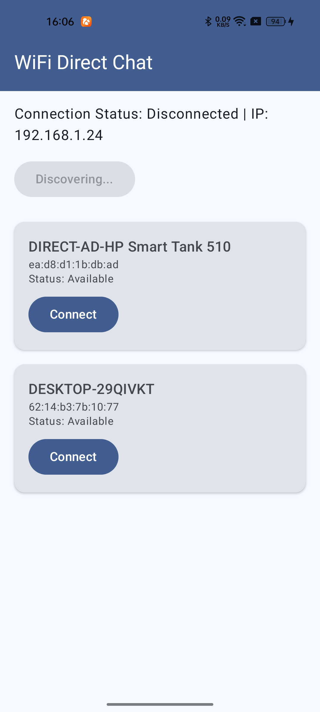
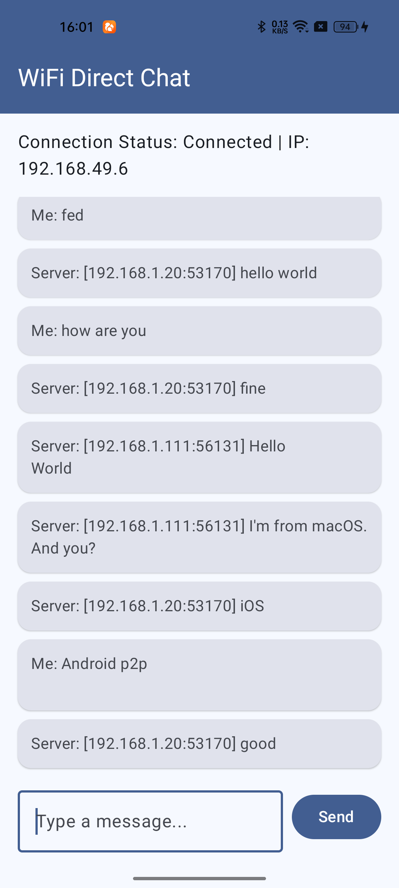

# WiFi Direct Chat

A simple WiFi Direct chat application that allows devices to connect directly and exchange messages.

## Features

- **WiFi Direct Device Discovery**: Discover nearby WiFi Direct devices
- **Auto Connection**: Automatically connect to chat server when WiFi Direct connection is established
- **Real-time Messaging**: Send and receive messages in real-time
- **IP Address Display**: Shows the device's WiFi Direct IP address
- **Connection Status**: Real-time connection status updates

## Requirements

- Android 7.0 (API level 24) or higher
- WiFi Direct supported device
- Chat server running on 192.168.49.1:8080

## Installation

1. Clone or download the project
2. Open the project in Android Studio
3. Build and run the project on your Android device

## Usage

1. Enable WiFi on your device
2. Launch the application
3. Grant the required permissions
4. Click "Discover Devices" to scan for nearby WiFi Direct devices
5. Select a device from the list and click "Connect"
6. Once connected, the application will automatically connect to the chat server
7. Type a message in the input field and click "Send" to send a message

## Screenshots

### Device Discovery


### Chat Interface


## Project Structure

```
├── app/
│   ├── src/
│   │   ├── main/
│   │   │   ├── AndroidManifest.xml
│   │   │   ├── java/com/iosdevlog/p2p/
│   │   │   │   ├── MainActivity.kt
│   │   │   │   ├── WifiDirectManager.kt
│   │   │   │   └── ChatClient.kt
│   │   │   └── res/
│   │   └── test/
│   └── build.gradle.kts
└── build.gradle.kts
```

## Permissions

The application requires the following permissions:

- `ACCESS_WIFI_STATE`: To check WiFi status
- `CHANGE_WIFI_STATE`: To enable/disable WiFi Direct
- `ACCESS_FINE_LOCATION`: To discover nearby devices
- `ACCESS_COARSE_LOCATION`: To discover nearby devices (Android 12+)
- `NEARBY_WIFI_DEVICES`: To discover nearby WiFi Direct devices (Android 13+)
- `INTERNET`: To connect to the chat server
- `CHANGE_NETWORK_STATE`: To manage network connections
- `ACCESS_NETWORK_STATE`: To check network status

## Technologies Used

- **Kotlin**: Primary programming language
- **Jetpack Compose**: UI framework
- **WiFi Direct API**: For device discovery and connection
- **TCP Socket**: For message communication

## License

This project is licensed under the MIT License.

## Contributing

Contributions are welcome! Please feel free to submit a Pull Request.

## Troubleshooting

- **No devices found**: Make sure WiFi is enabled and other devices are in WiFi Direct mode
- **Connection failed**: Check if the chat server is running on 192.168.49.1:8080
- **Messages not received**: Verify the WiFi Direct connection is stable

## Authors

- iosdevlog

## Version

1.0.0
